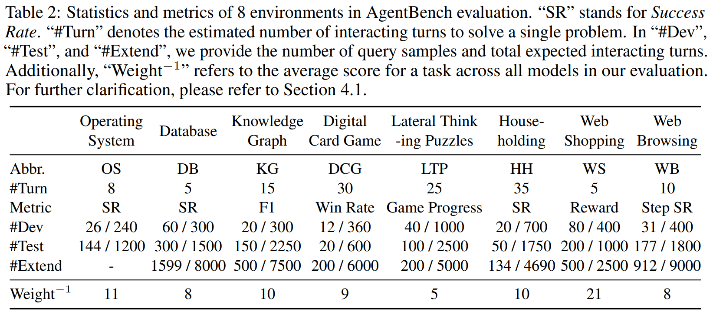
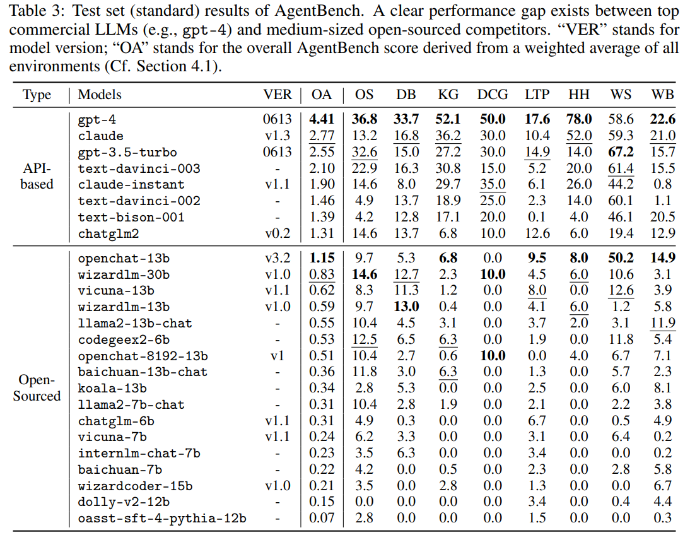

<p align="center">
   <a href="https://llmbench.ai" target="_blank">🌐 Website</a> | <a href="https://twitter.com/thukeg" target="_blank">🐦 Twitter</a> | <a href="mailto:agentbench@googlegroups.com">✉️ Google Group</a> | <a href="https://arxiv.org/abs/2308.03688" target="_blank">📃 Paper </a>
</p>

<p align="center">
👋 Join our <a href="https://join.slack.com/t/agentbenchcol-huw1944/shared_invite/zt-20ixabcuv-31cFLBAkqGQxQkJqrWVEVg" target="_blank">Slack</a>  for <i>Q & A</i> or <i><b>collaboration</b> on AgentBench v2.0</i>!
</p>

# AgentBench: Evaluating LLMs as Agents


https://github.com/THUDM/AgentBench/assets/129033897/656eed6e-d9d9-4d07-b568-f43f5a451f04


**AgentBench** is the first benchmark designed to evaluate **LLM-as-Agent** across a diverse spectrum of different environments. It encompasses 8 distinct environments to provide a more comprehensive evaluation of the LLMs' ability to operate as autonomous agents in various scenarios. These environments include 5 freshly created domains, namely 

- Operating System (OS)
- Database (DB)
- Knowledge Graph (KG)
- Digital Card Game (DCG)
- Lateral Thinking Puzzles (LTP)

as well as 3 recompiled from published datasets: 

- House-Holding (HH) ([ALFWorld](https://github.com/alfworld/alfworld))
- Web Shopping (WS) ([WebShop](https://github.com/princeton-nlp/webshop))
- Web Browsing (WB) ([Mind2Web](https://github.com/OSU-NLP-Group/Mind2Web))


## Table of Contents

- [Dataset Summary](#dataset-summary)
- [Leaderboard](#leaderboard)
- [Quick Start](#quick-start)
- [Turorial](#turorial)
- [Citation](#citation)


## Dataset Summary

We offer three splits for each dataset: Dev, Test, and Extend. Dev is fully public, while Test and Extend are private. In designing AgentBench, we balance evaluation thoroughness and efficiency. Though the number of problems in Dev and Test may seem small at 289 and 1,141, the multi-turn interaction requires an LLMs to generate around 4k and 13k times, making the testing time-consuming.



## Leaderboard

Here is the scores on test set (standard) results of AgentBench.



While LLMs begin to manifest their proficiency in LLM-as-Agent, gaps between models and the distance towards practical usability are significant.


Xlsx-format leaderboard data is available [here](https://github.com/THUDM/AgentBench/blob/main/assets/agentbench_leaderboard-230808.xlsx).

## Quick Start

To quickly understand how the framework works, you can follow the instructions below to run a simple evaluation.

### Step 1. Clone this repo and run the following command to install the requirements:

```bash
pip install --upgrade pip
pip install -r requirements.txt
```

### Step 2. Verify that you have successfully installed the requirements by running the following command:

```bash
python eval.py \
    --task configs/tasks/example.yaml \
    --agent configs/agents/do_nothing.yaml
```

### Step 3. Run Example Assignment

> *HINT: Example Assigment is composed of `gpt-3.5-turbo` and `ExampleTask` defined in [`src/tasks/example_task.py`](./src/tasks/example_task.py).*

You need to fill your [OPENAI KEY](https://platform.openai.com/account/api-keys) in `configs/assignments/example.yaml` first.

```yaml
Authorization: Bearer <%% PUT-YOUR-OPENAI-KEY-HERE %%>
```

Then run the following command:

```bash
python create_assignment.py \
    --assignment configs/assignments/example.yaml
```

And you can see the target assignment bash script from the output like this:

```yaml
[System] Run the following command to start evaluation:
    bash .assignments/<TIMESTAMP>.sh
```

Finally, run the assignment bash script that displayed in the output to start evaluation. After that, you can check your output in the `outputs` folder.

## Turorial

For more detailed instructions and advanced usage, please refer to our [tutorial](./docs/tutorial.md).

## Citation

```
@article{liu2023agentbench,
  title   = {AgentBench: Evaluating LLMs as Agents},
  author  = {Xiao Liu and Hao Yu and Hanchen Zhang and Yifan Xu and Xuanyu Lei and Hanyu Lai and Yu Gu and Hangliang Ding and Kaiwen Men and Kejuan Yang and Shudan Zhang and Xiang Deng and Aohan Zeng and Zhengxiao Du and Chenhui Zhang and Sheng Shen and Tianjun Zhang and Yu Su and Huan Sun and Minlie Huang and Yuxiao Dong and Jie Tang},
  year    = {2023},
  journal = {arXiv preprint arXiv: 2308.03688}
}
```
